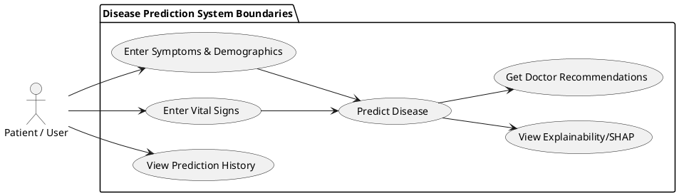
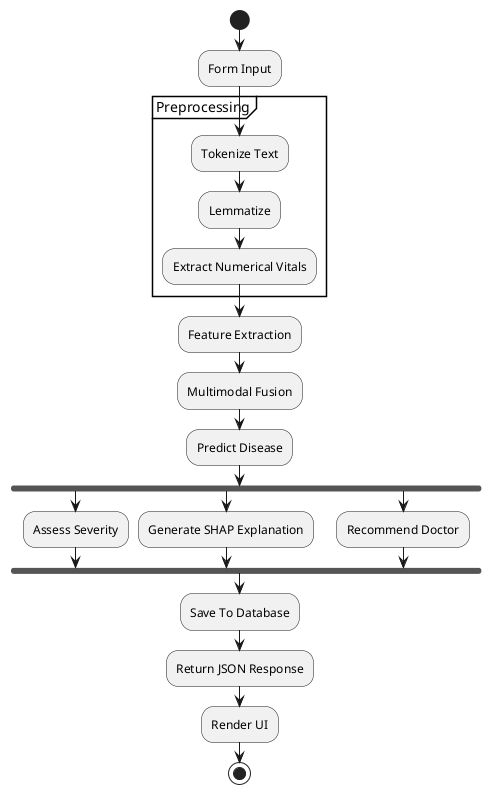
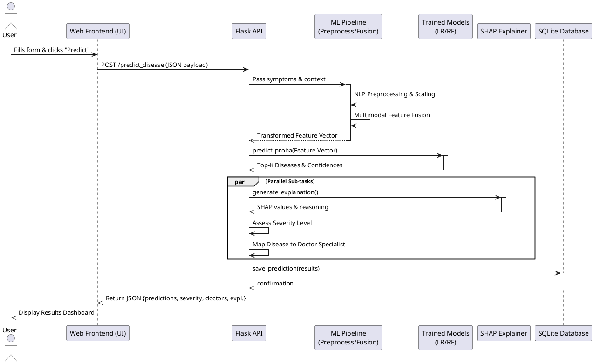
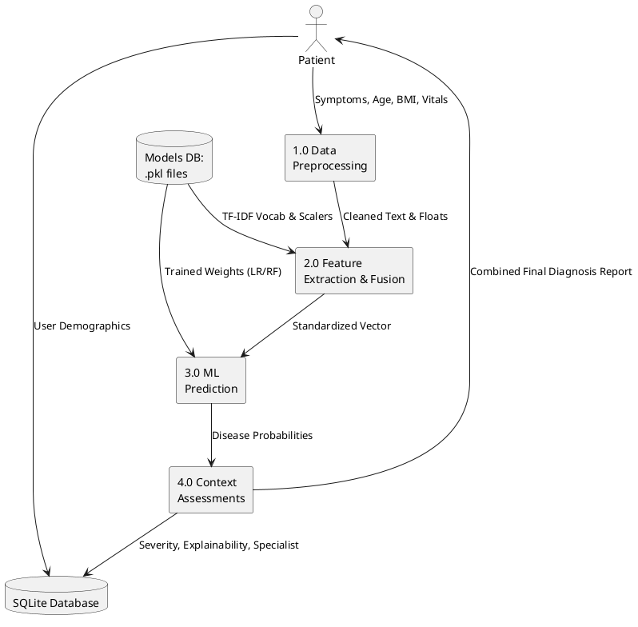

# PlantUML Diagrams

Here is the PlantUML code for all the requested software architecture diagrams. If you have the **PlantUML extension** installed in VS Code, you can press `Alt+D` (or `Option+D` on Mac) to preview these directly, or you can paste the blocks into [PlantUML Web Server](http://www.plantuml.com/plantuml).

---

## 1. Use Case Diagram

---

## 2. Activity Diagram

---

## 3. Sequence Diagram

---

## 4. Data Flow Diagram (DFD Level 1)
*(PlantUML uses component styling to emulate DFD entity flows)*

---

## 5. Collaboration (Communication) Diagram
*(Visualizes the interaction and message ordering between the individual python modules)*

```plantuml
@startuml
object "Web Application / UI" as UI
object "main.py / Flask API" as MainAPI
object "data_preprocessor.py" as PP
object "feature_extractor.py" as FE
object "fusion_module.py" as FM
object "disease_predictor.py" as DP
object "doctor_recommender.py" as DR
object "explainer.py" as EX
object "db_manager.py" as DB

UI -> MainAPI : 1: User Request Data
MainAPI -> PP : 2: Preprocess text/numbers
MainAPI -> FE : 3: Extract TF-IDF
MainAPI -> FM : 4: Concatenate features
MainAPI -> DP : 5: Predict probabilities
MainAPI -> EX : 6: Explain logic (SHAP)
MainAPI -> DR : 7: Recommend specialists
MainAPI -> DB : 8: Save transaction
MainAPI -> UI : 9: Return JSON payload
@enduml
```

