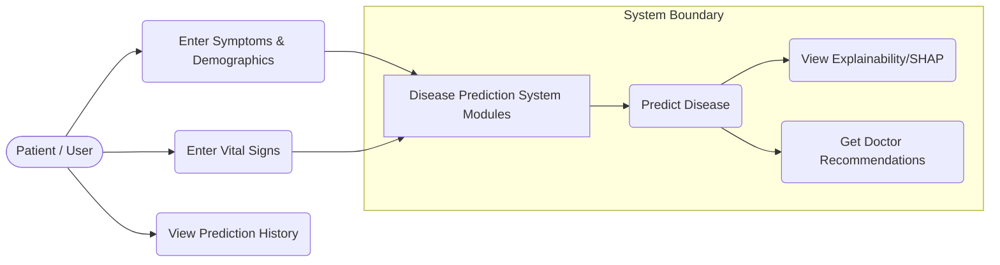
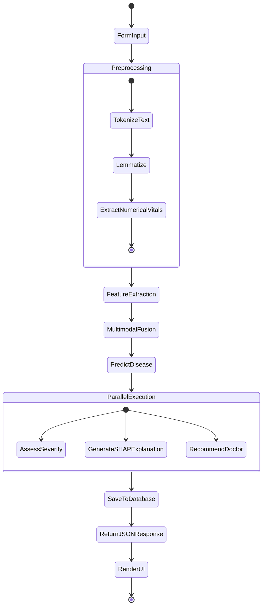
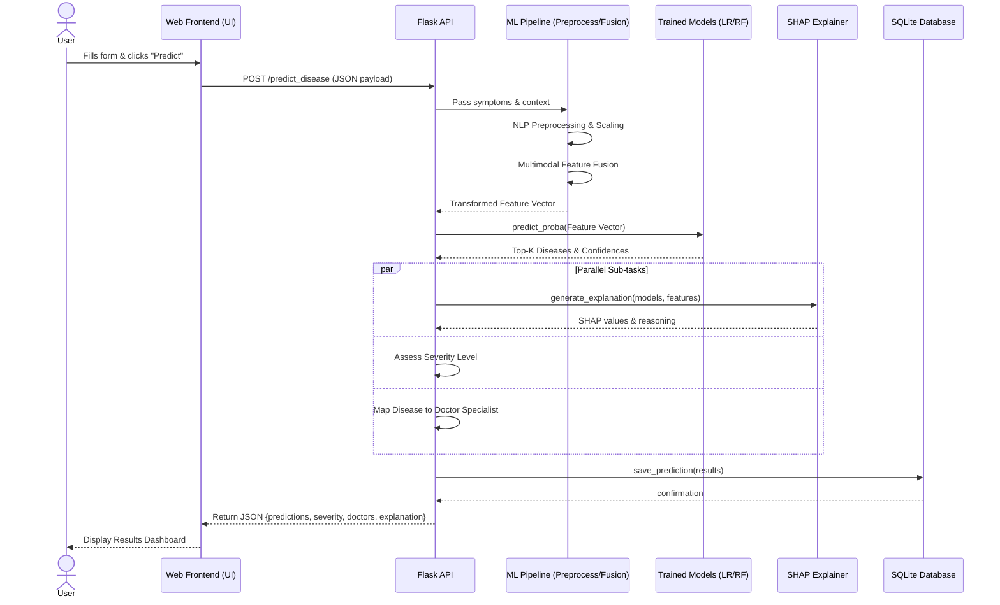
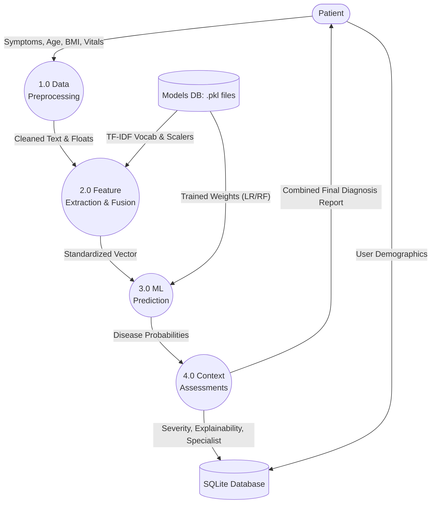
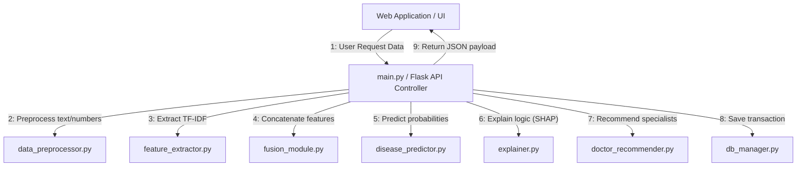

# System UML & Architecture Diagrams

This document contains standard UML and system diagrams for the **Context-Aware Multimodal Disease Prediction System**. These diagrams are written in Mermaid.js and can be viewed directly in VS Code by right-clicking this file and selecting **"Open Preview"**.

---

## 1. Use Case Diagram
Shows the primary interactions between the actors (Patient/User) and the system's core capabilities.

---

## 2. Activity Diagram
Visualizes the step-by-step workflow from the moment a user submits data to system completion.

---

## 3. Sequence Diagram
Demonstrates the chronological order of messages exchanged between system components for a prediction request.

---

## 4. Data Flow Diagram (DFD Level 1)
Shows the flow of data through the system processes and data stores.

---

## 5. Collaboration (Communication) Diagram
Visualizes the structural organization and message sequence between objects/modules.

